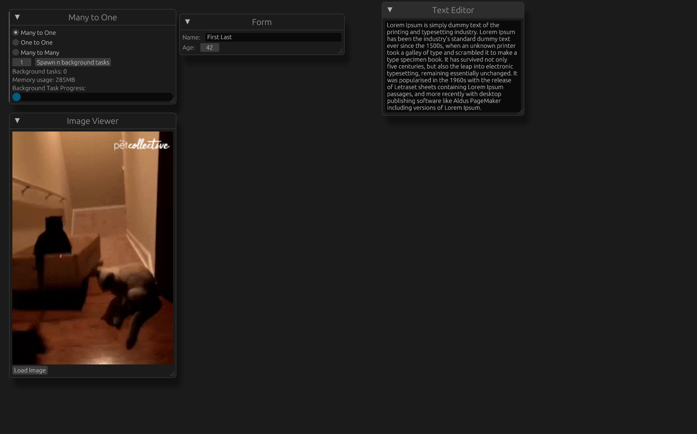

# The Demo

There are three different models for multi-threading in an operating system: Many to One, One to One, and Many to Many.
This program is a demonstration of how each threading model interacts with a set of dummy interactive apps alongside a variable number of
background processes that simulate a program blocking the current thread of execution with an IO operation for a duration between 0 and 1 second. The background tasks simulate 
something like a network request or disk IO.

## Many to One Model
The Many to One model involves having a single OS/Kernel thread that is shared between all user processes. While this model requires the least overhead in terms of performance
and memory usage, it is also the least flexible when it comes to blocking IO operations, requiring that all other processes wait for the blocking operation to finish. 

In the Many to One mode of the demo, it can be seen that by default, the interactive, non-blocking processes have no problem executing in real-time. However, if the user issues
a blocking request to the system by selecting a new file, the rest of the processes will not be responsive until the file picker dialogue closes. Additionally, there will be noticable
slowdown in all of the tasks if even a single blocking background task is started.

## One To One Model
The One to One model involves having creating a new OS/Kernel thread for each user process. This way, blocking IO operations or OS requests in one process do not impact the rest of
the system. This model is used in every major operating system due to its flexibility and resistance to misbehaving processes. The downside of having
 the OS manage all of these threads,however, is that it is not a trivial task, and having thousands of background processes will use a substantial amount of memory and noticeably
impact the responsiveness of the system. This makes the One to One model not ideal for situations where there are many concurrent processes.

In the One to One mode of the demo, the issues that the Many to One model had where all processes would pause with a blocking operation does not exist. The user can spawn many background
processes and issue blocking calls to the OS for the file picker without affecting the responsiveness of any other process. If the user spawns thousands upon thousands of
background processes however, the memory usage will increase notably and at some point depending on the hardware of the system, there will be slowdown as the OS struggles to
manage the number of threads.

## Many to Many Model
The Many to Many model is similar to the prior two models. It assigns many user processes to a single OS/Kernel thread, but also uses multiple OS/Kernel 
threads (usually a number equal to the number of hardware threads supported by the system) to accomplish this. This model is frequently referred to as Coroutines or 
Green Threads, as they do not require the OS to do the heavy lifting of managing potentially thousands of processes and their data structures. 
This allows the Many to Many model to have tens of thousands or hundreds of thousands of independent proecesses running without consuming more resources
than necessary. The downside of this model is that it requires the cooperation of the running processes to 'yield' execution or give up their time on the CPU either manually or 
by executing a blocking operation every once in a while, and having processes that do not cooperate in this model can bring the entire system to a halt.

In the Many to Many mode of the demo, we see that blocking operations through the file picker or background processes do not affect the execution of other processes, much like the
One to One model. Additionally, tens of thousands of background processes can be created with a minimal impact on memory consumption or CPU usage. The demo can illustrate the
downside of this model by spawning too many "evil processes." These processes simulate a program that does not cooperate with the system by yielding execution. Depending on the
number of hardware threads on the system running the demo, if the user creates too many of these problematic processes, the entire system will come to a halt, and only shutting down
the entire application will recover it.
